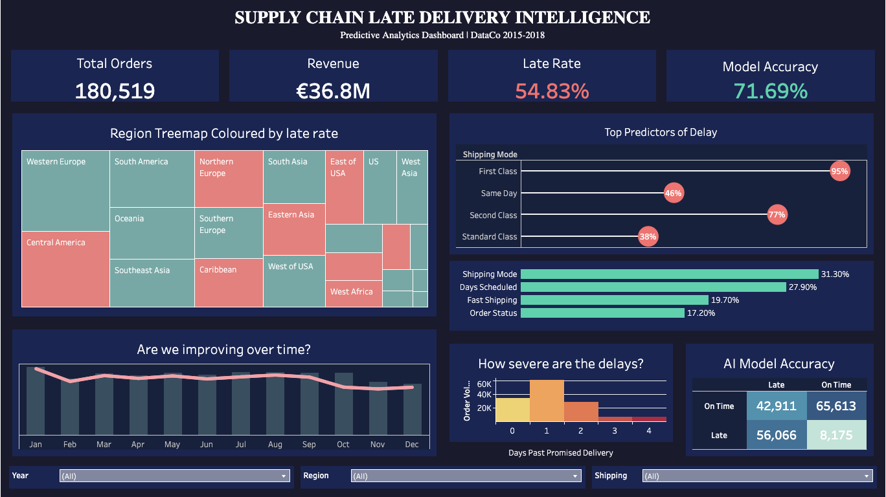

# 🚚 Supply Chain Late Delivery Intelligence
A full-stack data and machine learning project demonstrating an end-to-end analytics workflow — from raw data ingestion to predictive modelling and dashboard delivery.



---

# 📘 Table of Contents
- [Overview](#overview)
- [Business Problem](#business-problem)
- [Project Objectives](#project-objectives)
- [Architecture](#architecture)
- [Features](#features)
- [Dataset](#dataset)
- [Tech Stack](#tech-stack)
- [Installation](#installation)
- [Usage](#usage)
- [Machine Learning Model](#machine-learning-model)
- [SQL Capabilities Demonstrated](#sql-capabilities-demonstrated)
- [Project Structure](#project-structure)
- [Dashboard](#dashboard)
- [Contributing](#contributing)
- [Support](#support)
- [Author](#author)
- [Acknowledgements](#acknowledgements)
- [Licence](#licence)

---

# 🎯 Overview
This project analyses 180k+ supply chain orders to understand why over half of all deliveries arrive late and builds a **machine learning model** to predict late shipments *before they leave the warehouse*.

It demonstrates key capabilities required in **Business Intelligence, Data Analytics, Supply Chain Analytics, and ML Engineering**.

---

# 🏷️ Business Problem
Late deliveries increase customer churn, inflate operational costs, and disrupt supply chain efficiency.
In the dataset analysed:

- **54% of all orders** arrived late
- First Class shipping had a **95% late rate**
- Late delivery rates were **consistent across every product category**

This indicates a systemic issue rather than an isolated operational one.

---

# 🎯 Project Objectives
This project aims to:

1. Identify the root causes of late deliveries
2. Build a predictive model to flag at-risk shipments
3. Provide actionable insights for operations teams
4. Create a clean, maintainable analytics pipeline
5. Demonstrate technical and analytical proficiency for BI/Data roles

---

# 🏗️ Architecture

```text
┌─────────────────┐     ┌─────────────────┐     ┌─────────────────┐
│   Raw Data      │────▶│   PostgreSQL    │────▶│    Tableau      │
│   (CSV)         │     │   Star Schema   │     │   Dashboard     │
└─────────────────┘     └─────────────────┘     └─────────────────┘
│                       │                       │
▼                       ▼                       ▼
180k orders            ETL Pipeline            Interactive
53 features            Python + SQL            Visualisations
│
▼
┌─────────────────┐
│  ML Model       │
│  Random Forest  │
│  71% Accuracy   │
└─────────────────┘
```

# ⭐ Features

### 🔍 **Exploratory Analysis**
- Trend analysis
- Correlation mapping
- Feature importance evaluation

### 🛢️ **Data Engineering**
- Star schema design
- Clean ETL pipeline using pandas + SQLAlchemy
- Automated validation and transformation steps

### 🤖 **Machine Learning**
- Random Forest classifier
- Feature importance assessment
- Hyperparameter tuning

### 📊 **BI & Visualisation**
- Tableau dashboard
- KPI cards, drill-down insights, and storytelling

---

# 📦 Dataset

**Source:** [DataCo Smart Supply Chain](https://www.kaggle.com/datasets/shashwatwork/dataco-smart-supply-chain-for-big-data-analysis)
**Records:** 180,000+
**Features:** 53
**Period:** 2015–2019

---

# 🛠️ Tech Stack

| Layer | Technology |
|-------|------------|
| Database | PostgreSQL 15 |
| ETL | Python (pandas, SQLAlchemy) |
| Analysis | SQL (CTEs, Window Functions) |
| ML | scikit-learn (Random Forest) |
| Visualisation | Tableau Public |
| Version Control | Git/GitHub |

---
# 🔧 Installation

### 1. Clone the repository
```bash
git clone https://github.com/ItsTheBravo/supply-chain-analytics.git
cd supply-chain-analytics
```

### 2. Create a virtual environment
```bash
python -m venv venv
source venv/bin/activate  # macOS/Linux
venv\Scripts\activate     # Windows
```

### 3. Install dependencies
```bash
pip install -r requirements.txt
```

### 4. Import SQL schema into PostgreSQL
```bash
psql -U your_user -d your_db -f sql/create_tables.sql
```

### 5. Run ETL pipeline
```bash
python src/etl_pipeline.py
```

---

# ▶️ Usage

### Run data exploration
Open:
`notebooks/01_data_exploration.ipynb`

### Train ML model
`notebooks/02_machine_learning.ipynb`

### Generate Tableau export
The ETL pipeline outputs:
`tableau/tableau_export.csv`

Import this into Tableau to create dashboards or replicate the existing one.

---

# 🤖 Machine Learning Model

**Random Forest Classifier results:**

| Metric | Score |
|:-------|:------|
| Accuracy | 70.9% |
| Precision | 86.1% |
| Recall | 55.9% |
| F1 Score | 67.8% |
| AUC-ROC | 0.771 |

**🔑 Top Predictive Features**
1. Shipping Mode (31%)
2. Scheduled Ship Days (28%)
3. Fast Shipping Flag (20%)
4. Order Status (17%)

---

# 📈 SQL Capabilities Demonstrated
- CTEs
- Analytical Window Functions
- Ranking and cohort analysis
- Conditional logic using CASE
- Complex JOINs across star schema

---

# 📁 Project Structure

```text
supply-chain-analytics/
├── notebooks/
│   ├── 01_data_exploration.ipynb
│   └── 02_machine_learning.ipynb
├── sql/
│   ├── create_tables.sql
│   └── analytics_queries.sql
├── src/
│   └── etl_pipeline.py
├── tableau/
│   ├── tableau_export.csv
│   └── screenshots/
└── README.md
```

---

# 📊 Dashboard

Interactive Tableau dashboard providing:
- KPI summaries
- Shipping mode comparisons
- Geographic delivery patterns
- Root cause insights
- Predictive classification visuals

[View the Dashboard](https://public.tableau.com/app/profile/john.paul.mcgrath/viz/SupplyChainLateDeliveryIntelligence_17325492420950/Dashboard1)

---

# 🆘 Support

If you encounter issues or have feature requests, please open an Issue on GitHub.

---

# 👤 Author

**John-Paul McGrath**
- GitHub: [@ItsTheBravo](https://github.com/ItsTheBravo)
- LinkedIn: [John-Paul McGrath]([https://www.linkedin.com/in/johnpaulmcgrath/](https://www.linkedin.com/in/johnpmcgrath98/))

---

# 🙏 Acknowledgements
- Dataset provided by Shashwatwork on Kaggle
- Inspiration from supply chain BI case studies
- Visualisation delivered with Tableau Public

---

# 📄 Licence

This project is licensed under the MIT Licence.
You are free to use, modify, and distribute it with attribution.
